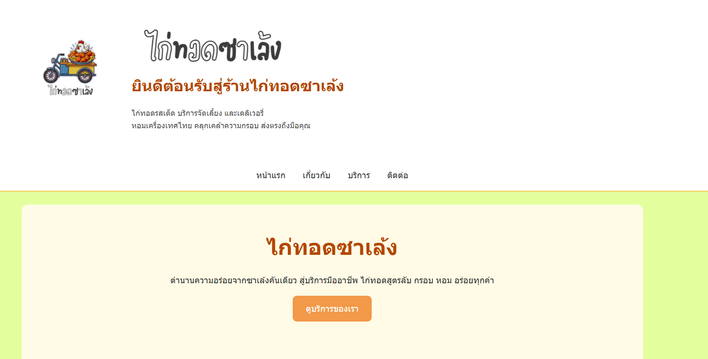

# my-business-web



**ชื่อโปรเจค:** ไก่ทอดซาเล้ง — เว็บไซต์แสดงข้อมูลธุรกิจไก่ทอด  
**คำอธิบาย:** เว็บตัวอย่างสำหรับการบ้าน/assignment ประกอบด้วย 4 หน้า: หน้าแรก (index.html), เกี่ยวกับ (about.html), บริการ (services.html) และ ติดต่อ (contact.html) โดยใช้ semantic HTML, meta tags, และฟอร์มที่มี client-side validation

## วัตถุประสงค์
-สร้างเว็บไซต์ธุรกิจที่มีหลายหน้า (Multi-page Website)
-นำ CSS ที่เรียนทั้งหมดมาประยุกต์ใช้จริง
-ออกแบบเว็บไซต์ให้สวยงาม อ่านง่าย และ responsive
-ฝึกการจัดโครงสร้างโปรเจกต์และใช้งาน GitHub

## โครงสร้างโปรเจค
my-business-web/
├── index.html # หน้าแรก (Homepage)
├── about.html # เกี่ยวกับเรา (About)
├── services.html # บริการ (Services)
├── contact.html # ติดต่อ (Contact)
├── css/
│ └── styles.css # ไฟล์ CSS หลัก
├── images/
│ ├── logo.png
│ ├── hero-bg.jpg
│ └── (images อื่น ๆ)
└── README.md

## CSS Features ที่นำมาใช้
1. CSS Selectors
-Universal Selector & Reset (* { margin:0; padding:0; box-sizing:border-box; })
-Element selectors: h1-h3, p, a
Class selectors: .hero, .card, .btn, .section, .container
-ID selectors: #header, #footer
-Pseudo-classes: :hover, :active, :first-child

2. CSS Units & Responsive Design
-px : border, shadow
-rem : font-size, margin, padding
-% : container, card width
-vw / vh : hero section

3. Layout Systems
-Flexbox: Navigation, Services section
-CSS Grid: Team members section
-Responsive layout รองรับหน้าจอมือถือ

4. Box Model
-Padding, Margin, Border, Border-radius
-Box-shadow สำหรับ card และ button

5. Positioning
-Sticky Header (position: sticky)
-Fixed elements (รองรับการพัฒนาเพิ่ม)
-z-index layering

6. Interaction & Effects
-Hover effects สำหรับ menu, button, card
-Transition เพื่อความลื่นไหลของ UI

## รูปหน้าจอ
(ใส่รูปหน้าจอที่ capture มาในโฟลเดอร์ images หรือแนบไว้ใน README โดยใช้ markdown image syntax)
- 
- 
- 
- 

## ลิงก์ไปยังแต่ละหน้า (ใน repo นี้)
- หน้าแรก: `index.html`
- เกี่ยวกับ: `about.html`
- บริการ: `services.html`
- ติดต่อ: `contact.html`

## วิธีใช้ / คำสั่ง Git (ตัวอย่าง)
```bash
# สร้าง repo ใหม่บนเครื่อง
git init
git add .
git commit -m "Initial commit - project scaffold"

# สร้าง repo บน GitHub ชื่อ my-business-web จากเว็บ github.com (หรือใช้ gh cli)
# สมมติ remote URL คือ git@github.com:USERNAME/my-business-web.git
git remote add origin git@github.com:USERNAME/my-business-web.git
git branch -M main
git push -u origin main
